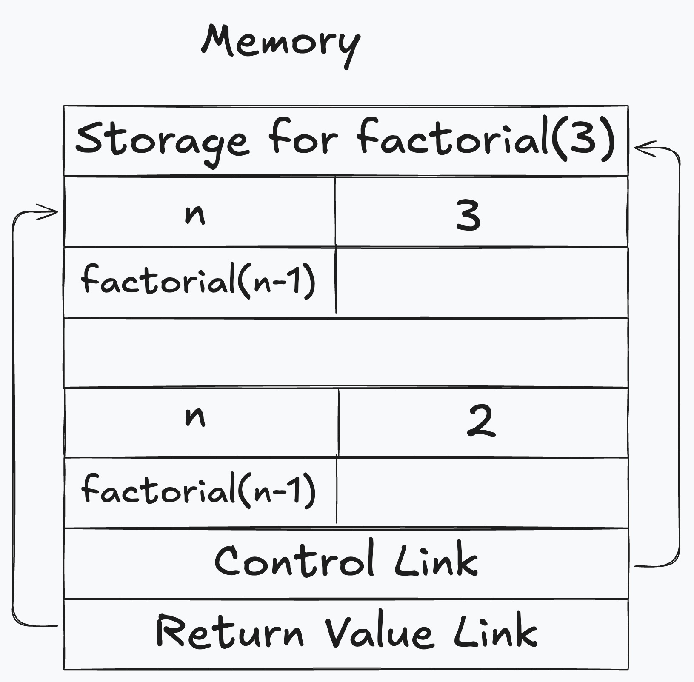

# Introduction
    Just as we need language to communicate, Programming languages are needed to communicate computational instructions
    
    Traditionally programming languages are very close to the computer architecture (Eg. Assembly) This makes the programming languages tedious and error prone
    
    In order to cope up with these problems, new languages used some level of abstraction which includes:
        - Assigning values to named variables
        - Conditional execution
        - Iteration
        - Functions/procedures
        - Aggregate data structures like arrays, list

    This results in programming languages to become more human readable and difficult for machines to understand the instructions. In order to tackle these issues, compiler and interpreter comes into place. Use of compiler and interpreter is a trade off as there is less control over how code is mapped to the architecture but there are fewer errors due to mismatch between intent and implementation 

# Compiler VS Interpreter

| **Aspect**              | **Compiler**                                              | **Interpreter**                                         |
|-------------------------|----------------------------------------------------------|-------------------------------------------------------|
| **Definition**           | Translates the entire source code into machine code before execution. | Translates and executes source code line by line.      |
| **Execution Speed**      | Faster, as the entire program is translated at once before running. | Slower, as it translates and executes code line by line. |
| **Output**               | Generates an independent executable file (e.g., `.exe`). | Does not produce a separate executable; runs the program directly. |
| **Error Detection**      | Detects and shows all syntax errors after compilation.   | Stops at the first error during execution.             |
| **Examples of Use**      | Used in languages like C, C++, Java (compilation phase). | Used in languages like Python, JavaScript.            |
| **Compilation vs. Execution** | Separate phases for compilation and execution.       | No separate phase; interpretation happens during execution. |
| **Platform Dependency**  | Once compiled, the executable is platform-specific.      | Requires the interpreter to be present on the platform. |

# Styles of Programming

| **Aspect**                | **Imperative**                                       | **Declarative**                                      |
|---------------------------|-----------------------------------------------------|----------------------------------------------------|
| **Definition**             | Focuses on *how* to perform tasks by specifying each step explicitly. | Focuses on *what* needs to be done, without explicitly specifying how. |
| **Style**                 | Procedural, step-by-step instructions.              | Describes desired outcomes using high-level abstractions. |
| **Control Flow**           | Explicitly controls the flow (loops, conditionals). | Implicit control flow handled by libraries or frameworks. |
| **Examples of Use**        | Low-level programming, like C, Java (traditional usage). | High-level programming, SQL, functional Java streams. |
| **Code Readability**       | Can become verbose and harder to understand for complex logic. | Generally concise and easier to read. |

## Sum of Even Numbers in an Array
### Imperative Way
```java
import java.util.Arrays;

public class ImperativeExample {
    public static void main(String[] args) {
        int[] numbers = {1, 2, 3, 4, 5, 6};
        int sum = 0;

        // Explicitly specifying how to calculate the sum
        for (int number : numbers) {
            if (number % 2 == 0) {
                sum += number;
            }
        }

        System.out.println("Sum of even numbers: " + sum);
    }
}
```
## Declarative Way
```java
import java.util.Arrays;

public class DeclarativeExample {
    public static void main(String[] args) {
        int[] numbers = {1, 2, 3, 4, 5, 6};

        // Declaring what needs to be done
        int sum = Arrays.stream(numbers)
                        .filter(number -> number % 2 == 0)
                        .sum();

        System.out.println("Sum of even numbers: " + sum);
    }
}
```
# Static VS Dynamic Typing
| **Aspect**             | **Static Typing**                                      | **Dynamic Typing**                                    |
|------------------------|-------------------------------------------------------|-----------------------------------------------------|
| **Type Checking**       | Done at compile-time.                                | Done at runtime.                                    |
| **Error Detection**     | Type errors are caught during compilation.            | Type errors are caught during program execution.    |
| **Explicit Typing**     | Variables must be explicitly declared with a type.    | Variables can hold any type and can change types dynamically. |
| **Performance**         | Faster execution because type checking is done beforehand. | Slower execution due to runtime type checking.      |
| **Flexibility**         | Less flexible; type constraints must be adhered to.   | More flexible; allows variables to change types.    |
| **Examples of Languages** | Java, C, C++, Kotlin.                               | Python, JavaScript, Ruby.                          |
| **Readability and Maintenance** | Easier to read and maintain due to explicit types. | Can become harder to debug in large codebases.      |

    Dynamic typing makes it difficult to find errors whereas in static typing error identification is easy saving time and effort
    In static analysis, compilers can perform optimisations like reordering statements to optimise reads and writes; store previously computed expressions to re-use it later.

# Variables
    Variables store intermediate values during computations
    Varibles can be:
        - Local to a function
        - Global: can be referred outside the function
        - Dynamically created data
`Scope`: whether the variable is available in the program

`Lifetime`: whether the storage is still located
## Memory Stack 
    -> Each function needs storage for local variables. An activation record is created when a function is called. 
    -> Activation records are stacked:
        - Popped when function exists
        - Control link points to start of previous record 
        - Return value link tells where to store result
    -> Parameters are a part of activation record of a function and the values are populated on function cal
    
## Initialising Parameters
    1. Call by value - copy the value {updatingt the value inside the function has no side effect}
    2. Call by reference - parameters point to the same value as argument {can have side effects}

## Activation Records
    - maintained as a stack
    - control link points to the previous activation record
    - return value link tells where to store result
## Heap
    - store dynamically allocated data
    - Outlives activation record of function that created the storage
    - Need to be careful about dellocating heap storage

